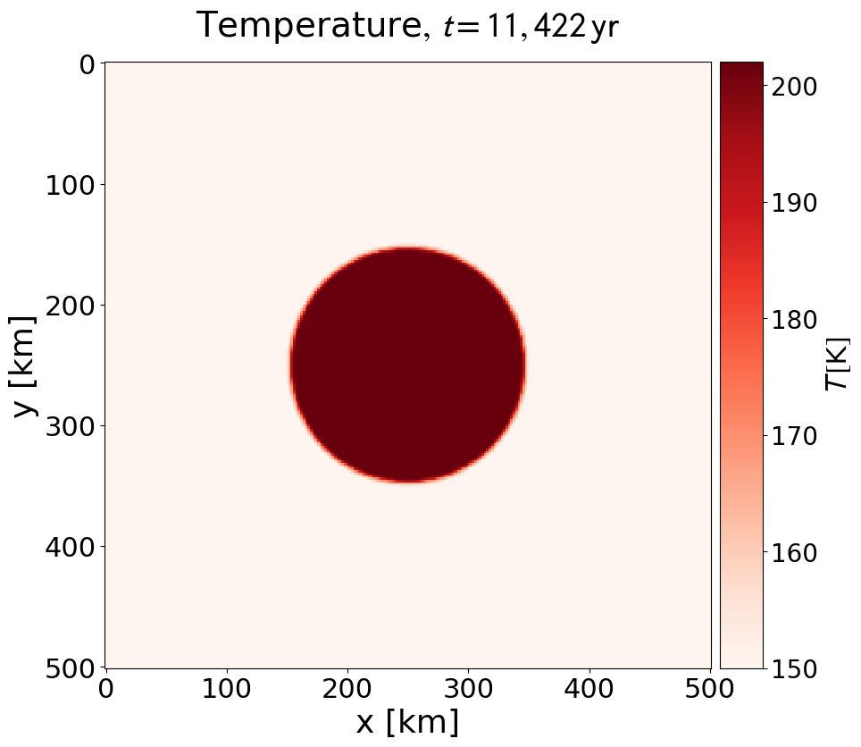

## General information

The simulation code hosted on this repository derives from the I2ELVIS code family, developed by [Taras V. Gerya](https://erdw.ethz.ch/en/people/profile.taras-gerya.html) (taras.gerya@erdw.ethz.ch). Below you will find references on the code, contact options and installation instructions.

## Contact

For questions, help and notifications surrounding this code repository please contact [Tim Lichtenberg](https://timlichtenberg.net/) (tim.lichtenberg@physics.ox.ac.uk) or [Gregor J. Golabek](http://www.staff.uni-bayreuth.de/~bt303373/) (gregor.golabek@uni-bayreuth.de).

## References

- Code and fluid dynamics basics

	> Gerya, T. (2019). Introduction to numerical geodynamic modelling. Cambridge University Press.

	> Gerya, T. V., & Yuen, D. A. (2007). Robust characteristics method for modelling multiphase visco-elasto-plastic thermo-mechanical problems. Physics of the Earth and Planetary Interiors, 163(1-4), 83-105.

	> Gerya, T. V., & Yuen, D. A. (2003). Characteristics-based marker-in-cell method with conservative finite-differences schemes for modeling geological flows with strongly variable transport properties. Physics of the Earth and Planetary Interiors, 140(4), 293-318.

- Research applications

	> Lichtenberg, T., Golabek, G. J., Burn, R., Meyer, M. R., Alibert, Y., Gerya, T. V., & Mordasini, C. (2019). A water budget dichotomy of rocky protoplanets from 26 Al-heating. Nature Astronomy, 3(4), 307-313.

	> Solferino, G. F., & Golabek, G. J. (2018). Olivine grain growth in partially molten Fe–Ni–S: A proxy for the genesis of pallasite meteorites. Earth and Planetary Science Letters, 504, 38-52.
	
	> Monteux, J., Golabek, G. J., Rubie, D. C., Tobie, G., & Young, E. D. (2018). Water and the interior structure of terrestrial planets and icy bodies. Space Science Reviews, 214(1), 39.
	
	> Hunt, A. C., Cook, D. L., Lichtenberg, T., Reger, P. M., Ek, M., Golabek, G. J., & Schönbächler, M. (2018). Late metal–silicate separation on the IAB parent asteroid: constraints from combined W and Pt isotopes and thermal modelling. Earth and Planetary Science Letters, 482, 490-500.
	
	> Lichtenberg, T., Golabek, G. J., Dullemond, C. P., Schönbächler, M., Gerya, T. V., & Meyer, M. R. (2018). Impact splash chondrule formation during planetesimal recycling. Icarus, 302, 27-43.
	
	> Golabek, G. J., Emsenhuber, A., Jutzi, M., Asphaug, E. I., & Gerya, T. V. (2018). Coupling SPH and thermochemical models of planets: Methodology and example of a Mars-sized body. Icarus, 301, 235-246.
	
	> Lichtenberg, T., Golabek, G. J., Gerya, T. V., & Meyer, M. R. (2016). The effects of short-lived radionuclides and porosity on the early thermo-mechanical evolution of planetesimals. Icarus, 274, 350-365.

	> Golabek, G. J., Bourdon, B., & Gerya, T. V. (2014). Numerical models of the thermomechanical evolution of planetesimals: Application to the acapulcoite‐lodranite parent body. Meteoritics & Planetary Science, 49(6), 1083-1099.
	
	> Tkalcec, B. J., Golabek, G. J., & Brenker, F. E. (2013). Solid-state plastic deformation in the dynamic interior of a differentiated asteroid. Nature Geoscience, 6(2), 93-97.

	> Lin, J. R., Gerya, T. V., Tackley, P. J., Yuen, D. A., & Golabek, G. J. (2011). Protocore destabilization in planetary embryos formed by cold accretion: Feedbacks from non-Newtonian rheology and energy dissipation. Icarus, 213(1), 24-42.
	
	> Golabek, G. J., Gerya, T. V., Kaus, B. J. P., Ziethe, R., & Tackley, P. J. (2009). Rheological controls on the terrestrial core formation mechanism. Geochemistry, Geophysics, Geosystems, 10(11).

	> Lin, J. R., Gerya, T. V., Tackley, P. J., Yuen, D. A., & Golabek, G. J. (2009). Numerical modeling of protocore destabilization during planetary accretion: Methodology and results. Icarus, 204(2), 732-748.
	

## Software requirements

- Intel compilers & MKL library (see below for installation instructions)
- Python 3.x

The code is tested on UNIX systems, such as macOS or Linux distributions.

## Minimum working example

1. Clone the code:
    ```
    git clone git@github.com:timlichtenberg/i2elvis_planet.git
    ```

1. Compile code:
	- On ETHZ Euler cluster:
	```
	module load intel
	sh compile.sh
	```
	- Local machine (requires Intel compiler, see further down):
	```
	bash compile.sh
	```
	- Compilation should produce the executables, including 'in2mart' and 'i2mart'.
1. Run code:
	- On ETHZ Euler:
	```
	sh submitjobs.sh
	```
	- Local machine:
	```
	./in2mart     # generates initial conditions
	./i2mart      # runs code
	```
  
1. Check output: plot the files using the python script in the 'support_files' folder
    ```
    python plot2d.py
    ```

1. Examine the output in the 'figures' folder, and compare them to the references
in the 'support_files/reference_output' folder.

	- main_temp_0002.png:
	
	
	
	- main_rho_0002.png:
	
	

## Install Intel compilers (icc) and MKL library

1. Install macOS command line tools (& Xcode via the App Store if you want to use it)
	```
	xcode-select --install
	```

2. Download Intel compilers and MKL library:
	- For macOS: install Xcode and the macOS command line tools (otherwise MKL installation will require relinking)
	- At ETH Zurich: https://idesnx.ethz.ch/
	- Otherwise download from official Intel website: https://software.intel.com/content/www/us/en/develop/tools/oneapi/components/dpc-compiler.html
		- Download and install 'Intel® oneAPI Base Toolkit' & 'Intel® oneAPI HPC Toolkit'
		- Use the online installer versions
		- Use command line installation only (no installation for Xcode on macOS)
	- In terminal, link to the new icc installation:
		```
		source /opt/intel/bin/compilervars.sh intel64 # (2018 version)
		source /opt/intel/oneapi/setvars.sh # (2020 oneAPI versions)
		```
		('which icc' should show sth alike '/opt/intel/compilers_and_libraries_2018.1.126/mac/bin/intel64/icc' (2018) or '/opt/intel/oneapi/compiler/2021.1.1/mac/bin/intel64/icc' (2020))
	

3. Try intel/MKL installation by compiling the code in the I2ELVIS directory:
	```
	bash compile.sh
	```
