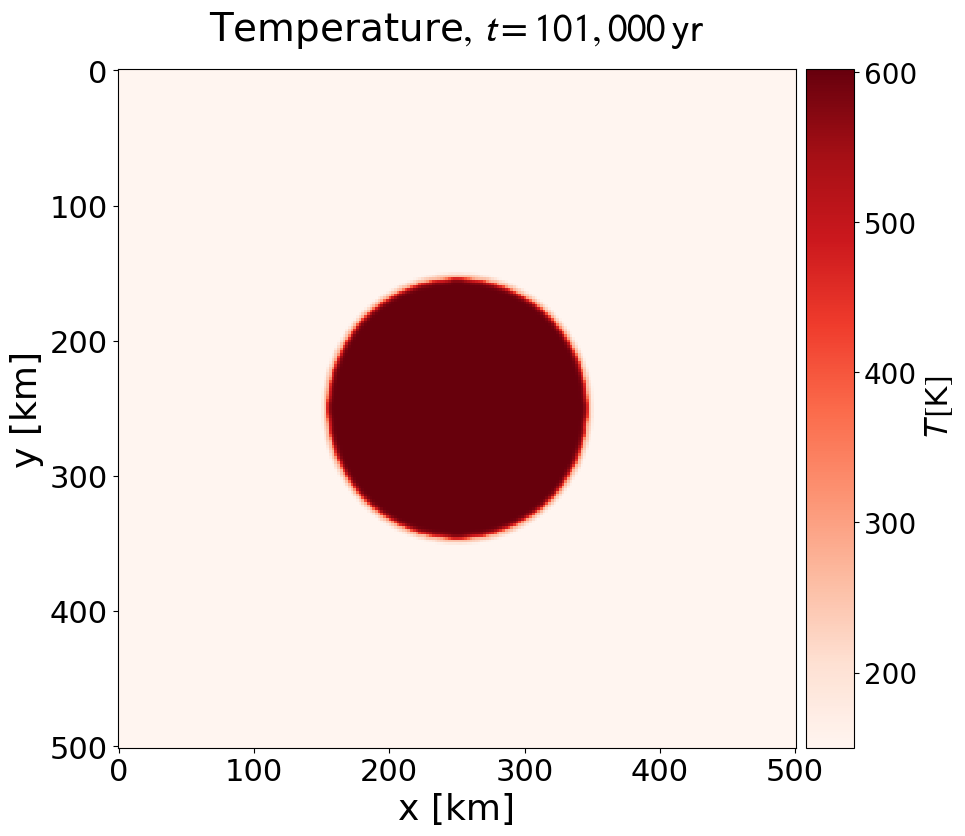
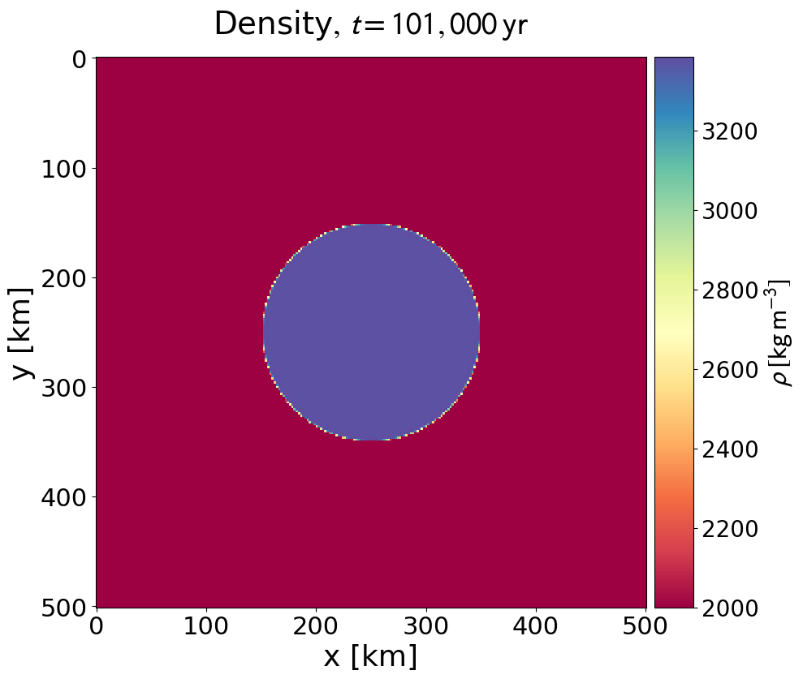

## Minimum working example to get the code up and running

1) Get code:
	>> git clone git@github.com:timlichtenberg/i2elvis_planet.git

2) Compile code:
	- On Euler:
		>> module load intel
		>> sh compile.sh
	- Local (needs Intel compiler):
		>> sh.compile

3) Run code:
	- On Euler:
		>> sh submitjobs.sh
	- Local:
		>> ./in2mart 	(generates *_0.prn, initial conditions)
		>> ./i2mart 	(runs code)

## Check the output

1) Plot the files using the python script in the 'support_files' folder
	>> python plot2d.py

2) Examine the output in the 'figures' folder, and compare them to the references
in the 'support_files/reference_output' folder.

	main_temp_0002.png:
	
	main_rho_0002.png:
	

## Install Intel compilers with MKL library on macOS

1) Install macOS command line tools (& Xcode via the App Store if you want to use it)
	>> xcode-select --install

2) Download Intel Parallel Studio XE 20XX from https://idesnx.ethz.ch/ (macOS version):
	- Follow the installation instructions closely:
		- Use the online installer ('m_ccompxe_online_2018.1.031.dmg' for the 2018 version)
		- Use command line installation only (no install for Xcode)
		- When you reach the dialog "Activation options" choose: "Choose alternative activation" -> "Use Intel(R) Software License Manager"
		- Enter the license server information: Host: "lic-intel.ethz.ch"; Port: "28000"
	- In terminal, link to the new icc installation:
		>>> source /opt/intel/bin/compilervars.sh intel64
		('which icc' should show sth alike '/opt/intel/compilers_and_libraries_2018.1.126/mac/bin/intel64/icc')
	- Attention: Installing Xcode or the macOS command line tools after MKL installation requires relinking (see item above)

3) Try intel/MKL installation by compiling the code:
	>> sh.compile
