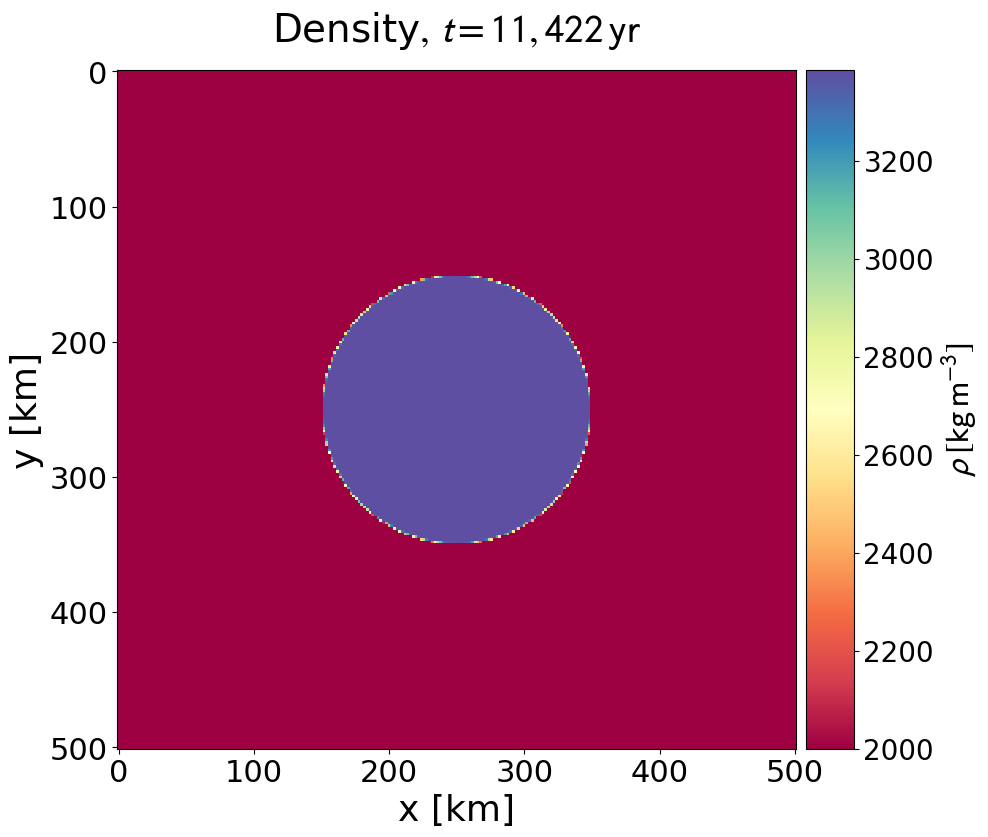

##### Minimum working example to get the code up and running

1) Get code:
	>> git clone git@github.com:timlichtenberg/i2elvis_planet.git

2) Compile code:
	- On Euler:
		>> module load intel
		>> sh compile.sh
	- Local (needs Intel compiler):
		>> sh.compile

3) Run code:
	- On Euler:
		>> sh submitjobs.sh
	- Local:
		>> ./in2mart 	(generates *_0.prn, initial conditions)
		>> ./i2mart 	(runs code)

##### Check the output

1) Plot the files using the python script in the 'support_files' folder
	>> python plot2d.py

2) Examine the output in the 'figures' folder, and compare them to the references
in the 'support_files/reference_output' folder.

	main_temp_0002.png:
	
	main_temp_0002.png:
	

